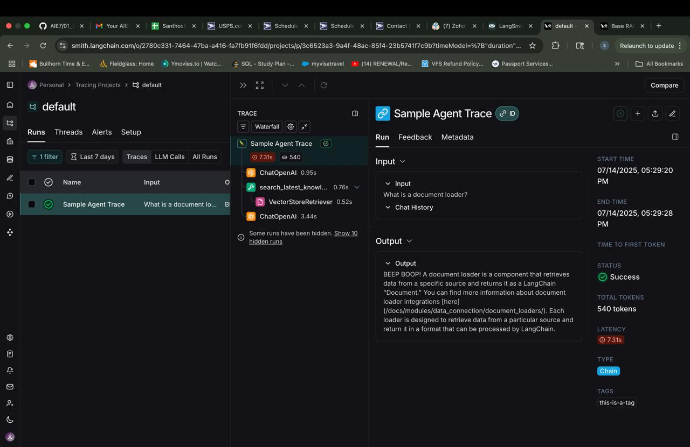

######### Assignment_Introduction_to_LCEL_and_LangGraph_LangChain_Powered_RAG ###########################################################

##### 🏗️ Activity #1:

While there's nothing specifically wrong with the chunking method used above - it is a naive approach that is not sensitive to specific data formats.

Brainstorm some ideas that would split large single documents into smaller documents.

#### Answer:
1. `split documents by full stops and combine 2–3 sentences per chunk.`
2. `detect Markdown or HTML tags like <h1>, ##, etc.`
3. `use embedding-based similarity to chunk on concept changes`

##### ❓ Question #1:
What is the embedding dimension, given that we're using `text-embedding-3-small`?
You will need to fill the next cell out correctly with your embedding dimension for the rest of the notebook to run.

#### Answer #1:
The embedding dimension for text-embedding-3-small is 1536.

#### ❓ Question #2:
LangGraph's graph-based approach lets us visualize and manage complex flows naturally. How could we extend our current implementation to handle edge cases? For example:
- What if the retriever finds no relevant context?  
- What if the response needs fact-checking?
Consider how you would modify the graph to handle these scenarios.

#### Answer #2:
To handle these scenarios, you can modify the graph as follows:
1. No Relevant Context Retrieved
Add a conditional node or edge to check if the retriever returned any documents. If not, route the state to:
	•	A fallback node that prompts the user for clarification or
	•	A default response node that says: "No relevant context was found."
2. Response Needs Fact-Checking
After the LLM generates a response:
	•	Add a fact-checking node that either:
	•	Runs a second LLM or toolchain to validate factuality
	•	Checks citation alignment (e.g., based on source URLs or similarity)
Depending on confidence, the graph can either:
	•	Proceed to response delivery, or
	•	Ask the user to refine the query or provide disclaimers.

----------------------------------------------------------------------------------------------------------------------------------------
####### LangSmith_and_Evaluation.ipynb ##########################################################################################

#### 🏗️ Activity #1:
Include a screenshot of your trace and explain what it means. 

####### Answer #1 :
This trace shows how my LangChain agent processed the input “What is a document loader?” by executing multiple steps—including tool use, vector retrieval, and LLM calls—with a successful output, helping me analyze and debug the flow and performance of my chain.

#### 🏗️ Activity #2:

Complete the prompt so that your RAG application answers queries based on the context provided, but *does not* answer queries if the context is unrelated to the query.

####### Answer #2 : The Answer in "I don't know" because the question asked is not in the context 

#### ❓Question #1:
What conclusions can you draw about the above results?
Describe in your own words what the metrics are expressing.

##### Answer #1:The trace shows that the RAG system correctly handled the query “What is a document loader?” by invoking a tool to retrieve relevant knowledge from a vector store and then generating a faithful and relevant response based entirely on that context. The assistant used the retrieved documentation snippet to explain what a document loader is and avoided adding hallucinated or unrelated information. This demonstrates that the current setup is working effectively—retrieval is returning accurate documents, the prompt constrains the LLM properly, and the chain logic is behaving as expected.